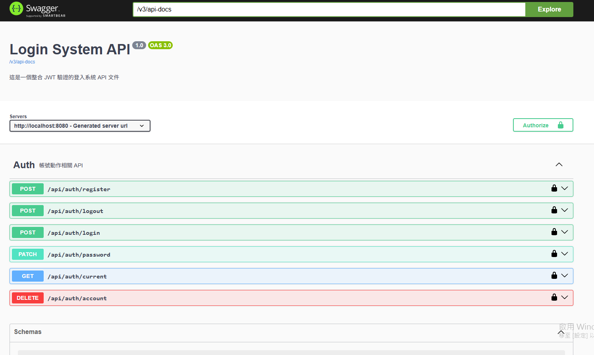

# Java Login System (Spring Boot & REST API)

本專案是一個以 Spring Boot 建構的後端登入驗證系統，模擬實務中常見的帳號認證流程，並採用分層架構設計，具備良好的擴展性與維護性。


## Introduction

本專案模擬實務中常見的帳號登入流程，包含：
 - 使用者註冊 / 登入 / 修改密碼 / 刪除帳號
 - BCrypt 密碼雜湊
 - 登入失敗次數限制與帳號鎖定機制
 - JWT 無狀態驗證機制
 - token 驗證機制
 - Redis 黑名單(實作登出)


## Tech Stack

 - Java 21
 - Spring Boot
 - MySQL
 - Redis
 - JWT ( JSON Web Token)
 - Maven

---

## Features

- 登入失敗次數限制與帳號鎖定
- 全域異常處理（Global Exception Handler）
- 統一 API 回應格式（ApiResponse<T>）

---

 ## 系統架構

 ```
Controller → Service → Repository → Database
 ```
Layer Responsibilities

１ Controller Layer

 - AuthController: 處理 REST API 請求，回傳 JSON 格式資料。

２ Service Layer

 - AuthService: 實作核心商業邏輯（登入流程、驗證、帳號鎖定）

３ Repository Layer

 - UserRepository: 負責資料存取，並透過介面解耦具體實作（MySQL / JSON）

---

## Project Structure

```sh

src/main/java/com/github/renny/loginsystem
├── controller    # API 層（處理 HTTP 請求）
├── service       # 商業邏輯（登入流程、驗證）
├── repository    # 資料存取層（MySQL）
├── dto           # Request / Response 資料結構
├── security      # JWT 工具與驗證
├── interceptor   # Token 攔截驗證
├── config        # 系統設定（JWT、Web）
├── exception     # 全域例外處理
└── policy        # 驗證規則（帳號 / 密碼）

```

---

## Design Highlights

- 密碼儲存由 SHA-256 升級為 BCrypt，提高安全性
- 驗證機制由 Session 重構為 JWT，提升系統擴展性
- 資料儲存由 JSON 遷移至 MySQL，提升可維護性與查詢效率
- 導入 Redis 作為 Token 黑名單，補強 JWT 無法主動失效的問題
- 採用分層架構與設計模式，提高系統可維護性

---

## How to Run

直接在 IDE 執行： LoginSystemApplication.java

API 測試介面：啟動專案後，造訪 http://localhost:8080/swagger-ui/index.html ，提供可互動的 API 文件與測試介面。

點擊右上角 🔒 Authorize -> 輸入 token -> 即可測試需要驗證的 API（如 /auth/current）

## How to Run (Maven)

```bash
mvn clean package
java -jar target/login-system-1.0-SNAPSHOT.jar

```

---


 ## Project Evolution
 
1. In-Memory
   → 初始版本，建立核心業務邏輯

2. JSON Persistence
   → 引入檔案儲存，解決資料持久化問題

3. MySQL Integration（Current）
   → 重構 Repository 層，導入資料庫
   → 提升系統擴展性與查詢效率

4. JWT Authentication
   → 將驗證機制由 Session 改為 Stateless JWT
   → 提升系統可擴展性

5. Redis Token Blacklist
   → 實作 Logout 機制
   → 補強 JWT 無法主動失效的問題

---

 ## API Documentation
本專案整合 Swagger (OpenAPI 3)，提供視覺化 API 調試介面。




